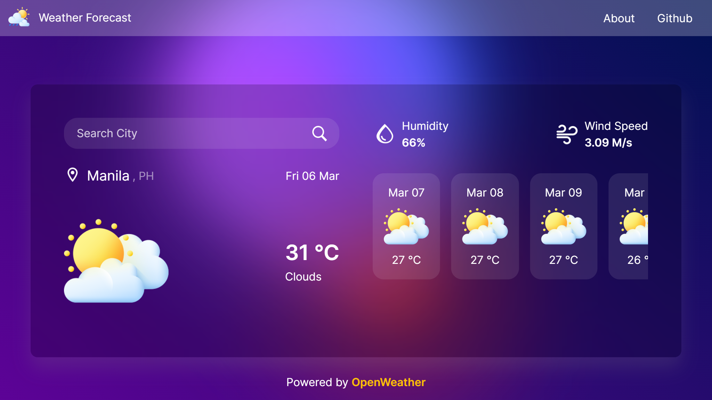
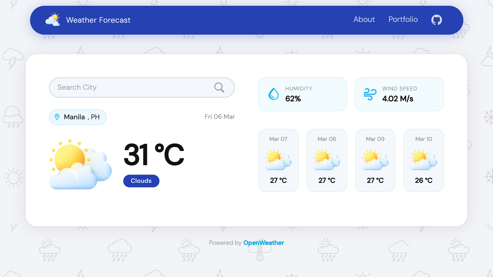

# Weather Forecast

A user-friendly weather forecast website that provides real-time and future weather updates for locations worldwide. This project utilizes modern web development tools and APIs to deliver accurate and dynamic weather data.

---

## Version Comparison

| V1                                              | V2                                              |
| ----------------------------------------------- | ----------------------------------------------- |
|  |  |

---

## What Changed in V2

- Cleaner, more modern design for a better look and feel.
- Faster and lighter performance by removing heavy effects.
- Better mobile and tablet responsiveness.
- Improved header/menu with quick Portfolio and GitHub access.
- Enhanced feedback form design and clearer form status messages.
- Smoother layout spacing and forecast card behavior.
- Better SEO setup for improved search visibility.
- Added extra security settings for safer deployment.

---

## Features

- **Current Weather**: View up-to-date temperature, humidity, wind speed, and more.
- **5-Day Forecast**: Check detailed weather predictions for the next five days.
- **Search Locations**: Easily search for cities or locations around the world.
- **Responsive Design**: Optimized for use on desktop, tablet, and mobile devices.
- **Dynamic Weather Icons**: Interactive icons and visuals that reflect real-time conditions.

---

## Tech Stack

- **Frontend**: HTML, SCSS, JavaScript, Vite
- **Backend**: JavaScript
- **API**: OpenWeather API
- **Styling**: Bootstrap
- **Deployment**: Vercel

---

## License

This project is licensed under the MIT License. See the [LICENSE](LICENSE) file for details.

---

## Contact

For any questions or feedback, feel free to reach out:

- **Email**: arinodavejoshua@gmail.com
